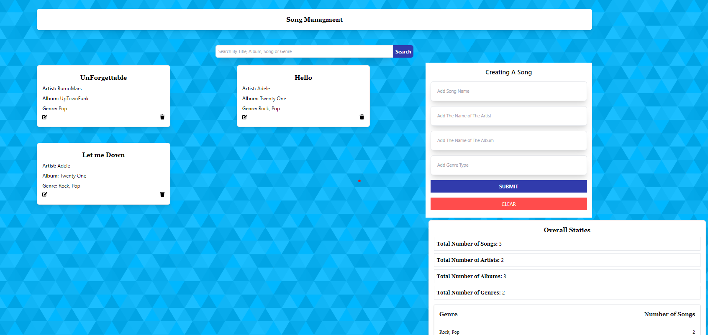

 
<h1 style="font-family: 'Montserrat'; font-size: 32px; font-weight: bold; color: #333; margin-bottom: 20px;"> Song Management System </h1> 

 Welcome to the Song Management System! This system allows users to create, update, read, and delete songs. It also provides overall statistics about the songs in the system. 
 
<h2>Features</h2> 
<ul> <li><strong>Create:</strong> Users can create a new song by providing its title, artist, album, genre, and release year.</li> 
<li><strong>Update:</strong> Users can update the details of an existing song, including any of the attributes mentioned above.</li> 
<li><strong>Read:</strong> Users can read and view the information of a specific song, including its details and statistics.</li> 
<li><strong>Delete:</strong> Users can delete a song from the system, removing it permanently.</li> <li><strong>Statistics:</strong> Users can obtain overall statistics about the songs in the system, such as the total number of songs, the most popular genre, and average release year.</li> </ul> 
<h2>Technology Used</h2> 

The Song Management System is built using the following technologies:
 
<ul> <li><strong>Frontend:</strong> React.js</li> <li><strong>State Management:</strong> Redux Toolkit</li> <li><strong>API Calls:</strong> Redux Saga</li> <li><strong>Backend:</strong> Express.js</li> <li><strong>Database:</strong> MongoDB</li> </ul> 
<h2>Installation and Configuration</h2> 
Follow these steps to configure and start the Song Management System:
 <ol> 
<li>Clone the repository from GitHub:</li> </ol> <pre><code>git clone https://github.com/HaileabWolde/Song-Managment.git</code></pre> <ol start="2"> <li>Change to the project directory:</li> </ol> <pre><code>cd client</code></pre> <ol start="3"> <li>Install the dependencies:</li> </ol> <pre><code>npm install</code></pre>  <ol start="5"> <li>Start the frontend and backend servers:</li> </ol> 
You will need two separate terminal windows or tabs for this.
 <pre><code># Frontend server npm start
Backend server
cd server
npm install
npm start</code></pre>

The frontend server will start on <code>http://localhost:3000</code> and the backend server will start on <code>http://localhost:5000</code>.
 
Access the Song Management System by opening <code>http://localhost:3000</code> in your web browser.
 <h2>Screenshots</h2> 
Here are some screenshots from the Song Management System:
   
